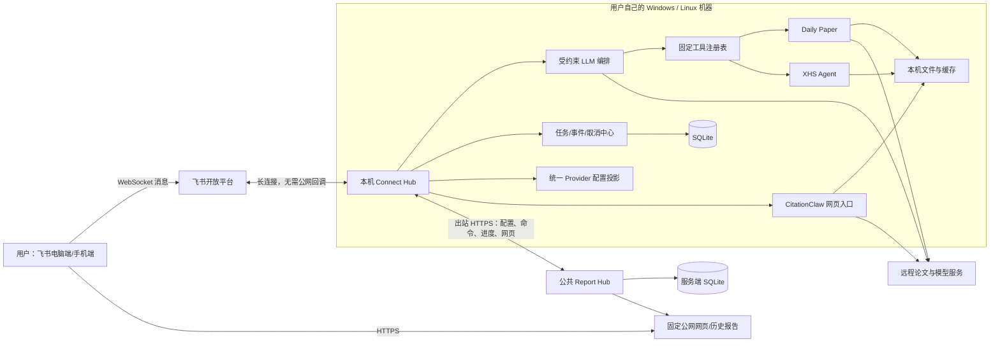
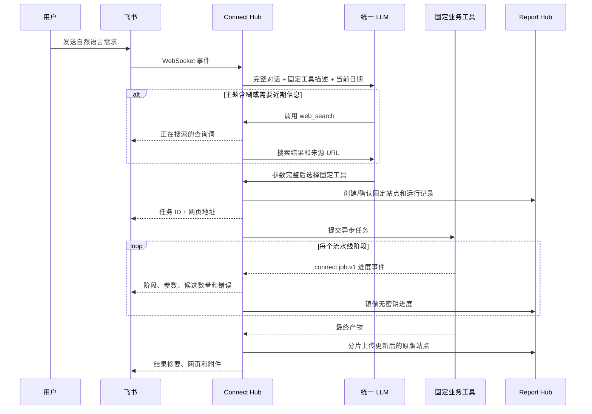

# Research Connect 作品设计说明书

## 1. 作品概述

Research Connect 是一套面向个人研究者和小型实验室的、本地优先的智能研究工具框架。用户在自己的 Windows 电脑、Linux 工作站或实验室服务器上运行系统，通过飞书机器人或原版网页完成论文检索、论文阅读、领域综述、引用分析和内容创作。

本作品不是单一聊天机器人，也不是把若干脚本简单拼接在一起。它重点解决的是：如何把多个由不同开发者实现、运行时间和依赖差异明显的 AI 工具，整合成一套容易部署、可以跨设备访问、具有统一任务语义和可调试能力的个人研究系统。

当前作品包含四类业务能力：

1. 论文日报：围绕研究主题检索近期论文，经过混合召回、融合、重排和 LLM 精筛后生成日报；
2. 论文阅读：总结论文 URL/PDF，或围绕主题和种子论文生成领域综述；
3. 查引用：分析学者、目标论文及其施引文献，生成引用画像和可视化报告；
4. 小红书内容生成：把研究材料转换为适合社交媒体发布的多页内容包。

系统同时提供两类交互入口：

- 飞书机器人适合随时发起任务、补充需求、查看进度和取消任务；
- 各模块原版网页适合填写复杂参数、浏览历史结果和使用可视化报告。

## 2. 设计背景与核心问题

### 2.1 使用场景

目标用户通常具有以下特征：

- 没有专门运维人员，不希望安装 PostgreSQL、Redis、Celery 或 Kubernetes；
- 可能使用 Windows 笔记本、Linux 工作站或无显示器服务器；
- 希望手机和电脑都能查看结果，但自己的电脑通常没有公网 IP；
- 有些任务只需几秒，有些论文任务可能运行几十分钟；
- LLM、Embedding、Reranker 和学术数据 API 可能存在限流、超时或共享额度；
- 不希望为了低频任务一直加载 PDF/视觉模型或保持重型 Worker 常驻。

### 2.2 需要解决的工程问题

三个原始业务项目分别拥有自己的配置、任务逻辑、网页、缓存和外部 API 调用方式。如果直接并列部署，会产生以下问题：

- 每个模块维护独立 Python 环境和依赖，安装复杂；
- 多套 LLM 客户端分别处理并发、429 和错误，行为不一致；
- 多套配置文件互相覆盖，用户不知道哪个配置生效；
- 飞书只看到“开始/失败”，难以判断论文在哪一步被筛掉；
- 长任务超时后可能留下孤儿进程；
- 本机网页不能直接被手机或外网访问；
- 模块升级后，字段和任务状态可能悄悄破坏上层集成。

Research Connect 的核心价值，就是为这些独立能力增加一层稳定、轻量且可持续演进的连接框架。

## 3. 总体设计思路

### 3.1 本地优先，而不是全部云端化

用户的飞书凭据、LLM Key、原始 PDF、运行进程和本地缓存主要保留在用户电脑。公共服务器只负责保存配置记录、接收受控命令、镜像无密钥进度以及托管发布后的网页副本。

这样既不要求每位用户购买云服务器，也避免把所有原始材料集中上传到统一后端。

### 3.2 Connect Hub 统一任务生命周期

业务模块负责“怎样完成任务”，Connect Hub 负责“任务从创建到结束如何被管理”。所有长任务统一拥有：

- 稳定任务 ID；
- `queued/running/cancelling/completed/failed/cancelled/timed_out/interrupted` 状态；
- 可去重的进度事件；
- 产物、错误码和调用费用记录；
- 受控子进程和真正取消；
- 飞书与网页两条反馈通道。

模块内部可以继续保留自己的 job ID，但它只作为内部执行句柄，不再成为对用户暴露的唯一任务系统。

### 3.3 受约束的 LLM 编排，而不是无限自主 Agent

飞书机器人使用 LLM 理解完整对话、判断是否需要搜索、追问或调用固定工具。系统没有采用无限循环、自主规划和任意代码执行式 Agent，而是采用“语义判断 + 固定工具 + 调用预算”的方式。

当前每条用户消息最多允许：

- 3 次模型调用；
- 1 次联网搜索；
- 1 次网页正文读取；
- 1 次昂贵业务工具调用。

这种设计保留了自然语言理解的灵活性，同时限制费用、死循环、重复任务和不可预测行为。

### 3.4 复用原版网页，不重复实现业务前端

Daily Paper 和 CitationClaw 已经拥有较完整的网页。Connect Hub 不再为它们重新编写一个简化报告页，而是把原版站点发布到固定公网 URL，并通过受控中继连接本机后端。

这使网页端和 Python CLI/飞书调用共享同一套业务实现，也保留了模块负责人已有的可视化和配置能力。

### 3.5 重能力按需运行，常驻层保持轻量

常驻进程只包括飞书长连接、Connect Hub、轻量 HTTP 服务壳和公网命令轮询。论文流水线、PDF 解析、Docling 和批量 LLM 调用只在任务开始后执行，结束后释放资源。

本项目默认使用远程 Embedding、Reranker、Supabase、Exa 和 Jina，不常驻本地 embedding/reranker 模型。

### 3.6 单一配置事实源

统一配置中心以安装为单位保存 Provider 和模块配置。Daily Paper 与 CitationClaw 原版设置页只是同一份记录的不同投影，不存在“某一份配置优先覆盖另一份”的关系。

密钥读取接口只返回“是否已配置”，不会向浏览器回显原文；空白密钥保存表示保留原值。

## 4. 总体技术架构



### 4.1 分层结构

| 层次 | 主要组件 | 职责 |
| --- | --- | --- |
| 交互层 | 飞书机器人、Docsify、CitationClaw Dashboard | 接收自然语言/表单输入，展示进度和结果 |
| 编排层 | Connect Hub `ChatService`、工具注册表 | 对话理解、联网富化、固定工具选择和调用预算 |
| 任务层 | `JobManager`、模块 Adapter | 状态机、事件、产物、取消、超时和错误映射 |
| 业务层 | Daily Paper、CitationClaw、XHS Agent | 完成论文检索阅读、引用分析和内容生成 |
| 公网协作层 | Report Hub | 安装隔离、固定站点、配置、命令队列、进度和报告托管 |
| 公共基础层 | `research-connect-core` | 统一 LLM 传输、数据目录、缓存索引和事件格式 |
| 存储层 | SQLite + 文件系统 + 远程 Supabase | 小型状态入库，大对象落文件，论文池走远程服务 |

## 5. 核心工作流程

### 5.1 飞书自然语言任务



### 5.2 公网网页调用本机功能

用户电脑通常没有公网 IP，因此不能让 Report Hub 直接请求 `127.0.0.1`。系统采用反向命令中继：

1. 用户在公网原版网页点击运行或保存配置；
2. Report Hub 验证该站点声明的动态接口白名单，把请求写入安装专属命令队列；
3. 本机 Connect Hub 主动以出站 HTTPS 拉取命令；
4. Connect Hub 将命令转发到本机 Daily Paper/CitationClaw；
5. 本机结果沿原连接返回 Report Hub，再返回浏览器。

该设计不需要端口映射、内网穿透、扫码登录或为每位用户申请域名，同时能继续使用原版动态网页。

### 5.3 长任务取消

Connect Hub 保存受控子进程 PID/进程组。取消时先把任务置为 `cancelling`，调用模块取消接口，并终止已知进程树；Windows 使用进程组和 `taskkill /T`，Linux 使用独立 session/process group。

服务启动时不会恢复旧任务，而是把遗留的 `queued/running/cancelling` 标记为 `interrupted`，清理仍存在的已知子进程，避免重启后把孤儿任务误认为仍在运行。

## 6. 功能模块设计

### 6.1 Connect Hub：系统核心

Connect Hub 是用户电脑上唯一的总控入口，主要包含：

#### 飞书连接器

- 使用飞书 WebSocket 长连接，不需要公网回调地址；
- 接收文本、菜单事件和 PDF 附件；
- 支持 `/config`、`/paper_reader`、`/citationclaw`、`/jobs`、`/job`、`/cancel` 等命令；
- 将任务进度、结果文件和固定网页地址发送回原会话。

#### 对话理解与工具调用

- LLM 基于完整对话语义理解“确认”“重试刚才任务”等短回复；
- 不依赖正则表达式决定昂贵工具调用；
- 只在关键需求确实缺失时追问；
- 日报任务使用一次联网 Intent 预检，生成 2～4 条英文语义查询供用户确认或修改；
- 综述任务可通过联网搜索补充任务定义、方法路线和 benchmark；
- CitationClaw 当前从菜单直接进入原版网页，避免让 LLM 替用户猜复杂表单参数。

#### 联网能力

- Exa MCP 搜索公开网页，返回结构化标题、URL、摘要、发布时间和分数；
- Jina Reader 获取选中网页/PDF的结构化正文；
- 搜索结果作为上下文交给 LLM，最终回答保留来源 URL；
- 本地不部署搜索模型，联网失败会返回清晰错误而不是伪造结果。

#### 任务与可观测性

- SQLite 持久化任务、事件、产物、缓存索引和调用记录；
- 提供统一错误码并区分未授权、429、配额、超时、模块失败和输出无效；
- 记录 Provider、API 次数、token、耗时和状态码；
- 飞书可查询任务详情、完整事件、产物和费用摘要。

### 6.2 Daily Paper：论文研究流水线

Daily Paper 在同一原版网页中提供三项能力。

#### 论文日报

论文日报面向“最近一段时间某方向有什么值得看的论文”，主要流程为：

```text
主题与 Intent
  → LLM 扩充关键词
  → BM25 关键词召回 + Embedding 语义召回
  → RRF 融合去重
  → 专用 Reranker
  → LLM 精炼评分
  → 精读/速读选择
  → 正文读取、图表解析和日报生成
```

每个阶段会报告输入量、输出量、阈值、分数分布、并发数和实际 Provider，便于定位“为什么最终没有推荐”。

BM25 擅长命中明确术语，Embedding 用于寻找语义相关但措辞不同的论文，RRF 在不强行统一两种分数尺度的情况下融合排名，Reranker 和 LLM 精筛再逐步压缩候选。

#### 单篇论文总结

- 接受 arXiv/普通论文 URL；
- 支持在飞书上传 PDF，也支持在原版公网网页拖放 PDF；
- 获取元数据、解析正文、生成 TL;DR、研究问题、方法、结果、创新点和局限；
- 使用 Docling 提取 PDF 中的图表，缺少 GPU 时走 CPU；
- 任务结束后写入论文页并更新原版站点。

#### 领域综述

- 输入研究主题、回溯范围、候选数、精选数和可选种子论文；
- 执行查询规划、多路召回、相关性抽取、聚类、核心论文全文深读；
- 按主题簇并行分析，生成全局分析、导演式大纲和分节报告；
- 校验引用编号，完成审校后写入固定综述页。

### 6.3 CitationClaw：查引用与学者画像

CitationClaw 保留原版 Dashboard 操作方式，能够：

- 从学者主页、作者名或论文信息定位目标论文；
- 通过 Semantic Scholar 获取论文、作者和施引关系；
- 使用 OpenAlex、Web of Science、Google Scholar/ScraperAPI 等可选来源补充数据；
- 对施引论文进行筛选、PDF 获取和引用语境分析；
- 输出 HTML Dashboard、表格和中间数据文件；
- 在网页端实时显示任务日志，并在完成后保留历史报告。

基础服务和进阶服务的处理深度不同。例如“引用描述综合分析”属于需要额外搜索和正文处理的阶段，不会在基础模式中假装生成。

### 6.4 XHS Agent：研究内容传播

XHS Agent 将主题、受众、目的、页数、风格和用户材料转换为：

- 多页内容结构；
- 每页标题和正文；
- 可渲染卡片图片；
- Markdown 文案和内容包。

该模块运行较轻，适合短时间多次调用。后续可增加可选视觉模型审查，用于判断页面疏密和排版美观度，但不会把视觉模型设为默认部署依赖。

### 6.5 Report Hub：公网协作层

Report Hub 是唯一需要公网域名的组件，主要职责包括：

- 为每个本机安装签发独立 agent token，服务端只保存哈希；
- 为 Daily Paper 和 CitationClaw 分配稳定站点 URL；
- 保存统一配置及其模块投影；
- 保存任务、运行快照、事件和静态报告；
- 支持大站点分片上传和原子替换；
- 提供受限动态命令队列，使公网原版网页可以操作本机后端；
- 在用户电脑关机后继续提供已经发布的历史网页。

普通安装 token 只能访问本安装拥有的站点、配置和命令，服务器管理员 token 用于签发、轮换和撤销安装，不分发给普通用户。

### 6.6 research-connect-core：共享基础库

共享包承载跨模块不应重复实现的能力：

- OpenAI 兼容 LLM 传输和重试；
- `connect.job.v1` 事件对象与 JSON Lines 输出；
- 统一数据根目录；
- 文件缓存索引；
- Playwright 浏览器目录管理。

业务模块仍可用自己的 Python CLI 独立运行，但共享的 LLM、数据目录和事件语义同样生效。

## 7. 数据与协议设计

### 7.1 本机数据模型

Connect Hub 的 SQLite 主要包含：

| 表 | 作用 |
| --- | --- |
| `jobs` | 任务类型、模块、状态、PID、起止时间、错误码和输入摘要 |
| `job_events` | 结构化进度、回调数据和去重事件 ID |
| `artifacts` | 文件、URL、类型、大小和任务关联 |
| `cache_index` | PDF、正文、图片和摘要缓存的索引 |
| `usage_records` | Provider、调用次数、token、耗时和状态码 |
| 会话相关表 | 飞书对话历史、联网模式、首次提醒和任务关联 |

SQLite 只保存小型结构化数据。PDF、图片、网页、Markdown、HTML 和大型 JSON 保存为文件，避免把数据库变成大对象仓库。

默认统一数据根为：

```text
~/.research-connect/data/
  modules/
    connect-hub/{state,cache,artifacts}/
    daily-paper-reader/{state,cache,artifacts}/
    citationclaw/{state,cache,artifacts}/
    xhs-agent/{state,cache,artifacts}/
```

### 7.2 `connect.job.v1` 模块协议

稳定协议包含：

- `ModuleManifest`：模块名、版本、支持的任务和能力；
- `JobRequest`：任务 ID、任务类型、输入和选项；
- `JobAccepted`：接受状态和模块内部句柄；
- `JobEvent`：事件 ID、阶段、消息、当前值、总数和扩展数据；
- `cancel(job_id)`：取消握手；
- artifact/cost/error：产物、费用和标准错误信息。

`schema_version` 明确写为 `connect.job.v1`。协议允许增加可选字段，但删除或修改既有字段必须升级版本，避免模块更新后静默破坏 Connect Hub。

### 7.3 统一错误码

系统将模块和外部 API 异常映射为稳定错误码，包括：

- `CONFIG_REQUIRED`；
- `MODULE_INCOMPATIBLE`；
- `PROVIDER_UNAVAILABLE`；
- `PROVIDER_UNAUTHORIZED`；
- `PROVIDER_RATE_LIMITED`；
- `PROVIDER_QUOTA_EXHAUSTED`；
- `OUTPUT_INVALID`；
- `JOB_TIMEOUT`；
- `JOB_CANCELLED`；
- `SERVICE_RESTARTED`。

用户看到可理解的说明，技术日志保留脱敏诊断；Key、Bearer token 和 Secret 会在错误输出中替换为 `[redacted]`。

## 8. 统一配置与 Provider 设计

配置中心按照实际流水线顺序展示 Provider：

- 统一 LLM；
- Exa MCP 与 Jina Reader；
- arXiv Supabase 论文池；
- 论文 Embedding 与 Reranker；
- DeepXiv；
- Semantic Scholar、OpenAlex、Web of Science；
- CitationClaw Search LLM、ScraperAPI 和 MinerU 等可选能力。

每个 Provider 使用稳定 ID，例如 `llm.primary`、`embedding.paper`、`rerank.paper`、`supabase.arxiv` 和 `citation.semantic_scholar`。统一记录会被转换成模块原生字段和任务环境变量。

Demo 预置上游公开的 Supabase、Embedding 和 Reranker 配置，减少首次安装步骤；用户仍可替换为自己的兼容服务，并主动点击“测试可用性”。系统不会在每次任务启动前自动探测所有 API，以免产生额外请求或费用。

## 9. 关键技术难点

### 9.1 多项目异构整合

三个业务模块不是从同一模板开发：它们拥有不同的 CLI、HTTP API、任务状态、网页资产、配置格式和输出目录。难点不在于调用一个函数，而在于建立不侵入业务核心的 Adapter，把不同模块映射到统一任务、进度、错误和产物语义，同时继续兼容模块独立 CLI。

### 9.2 自然语言灵活性与系统可控性的平衡

纯正则和固定槽位会把“occ”“再来一次”“确认”等对话理解得很僵硬；完全自主 Agent 又可能重复调用昂贵任务。系统让 LLM 结合历史语义决定工具，同时用固定工具表、每轮预算、业务调用唯一性和高成本任务授权规则形成硬边界。

这是一种“模型负责理解，程序负责权限与资源边界”的混合设计。

### 9.3 本机动态网页的安全公网访问

原版网页依赖 Python API，但用户电脑没有公网入口。普通静态托管无法执行任务，直接内网穿透又增加账号、端口和安全成本。

本项目实现安装隔离的反向命令中继，并通过模块声明的动态接口策略限制允许的方法和路径。它既支持 PDF 上传、配置保存、任务启动和结果读取，又不把整个本机 HTTP 服务暴露到互联网。

### 9.4 长任务的真实进度与故障定位

论文流水线不是单次 LLM 请求，而是数十分钟、多阶段、多 Provider 的过程。仅显示“正在运行”无法调试。

系统需要从原始日志和模块事件中提取：

- 日期窗口与运行模式；
- 每路召回输入/输出数量；
- Reranker/LLM 分数分布与阈值；
- 精读和速读选择数量；
- PDF 获取和逐篇生成进度；
- 并发度、429、超时和具体 Provider。

同一事件还要在 SQLite、飞书和网页之间去重，避免网络重试导致重复消息。

### 9.5 跨平台进程树取消

日报会继续派生 Python 子进程和并发任务。仅终止最外层 PID 会留下后台工作继续消耗 API。Windows 和 Linux 的进程模型不同，因此必须分别实现受控进程组、模块取消握手、超时终止和启动清理。

### 9.6 配置同步与密钥边界

统一配置要同时服务飞书、Daily Paper 网页、CitationClaw 网页和 Python CLI，并保证任一入口修改后其他入口看到相同结果。实现时还要处理：

- 密钥不回显；
- 留空保留旧值；
- 公共 Key 与用户私有 Key 的差异；
- 模块原生字段映射；
- 任务只接收实际需要的最小凭据；
- 日志、事件、SQLite 和产物脱敏。

### 9.7 PDF 与长文档处理

PDF 可能来自 URL、arXiv 或飞书附件，正文结构和图表差异很大。系统需要完成来源识别、元数据解析、PDF 下载、文本提取、图表定位、缓存和 LLM 总结，并控制文件大小和超时。

Docling 按任务加载，可在 GPU/CPU 环境运行；PyMuPDF 保留为基础解析能力，但不会假装替代完整文档理解。

### 9.8 Windows/Linux 一致性

项目必须同时处理 PowerShell/Bash、路径分隔符、编码、长文件名、Playwright 浏览器位置、子进程信号和 Python 可执行路径。领域综述曾经生成超长 Windows 文件名，因此报告路径采用可读短 slug 与稳定 hash 组合，避免仅在 Linux 可运行。

## 10. 技术特点与创新点

1. **本地能力 + 公网展示解耦**：计算在个人设备，网页通过共享 Report Hub 长期访问；
2. **原版网页动态中继**：不是重写低配前端，也不是暴露本机端口；
3. **受约束语义 Agent**：去掉僵硬槽位状态机，同时用程序预算限制不确定性；
4. **模块协议化**：通过 `connect.job.v1` 把多个独立项目转化为可替换工具；
5. **统一配置事实源**：多入口配置实时一致，Provider 按流水线组织；
6. **可解释的论文筛选漏斗**：从召回到最终推荐持续报告数量、阈值和分布；
7. **轻量常驻、按需计算**：适合个人电脑，而不是要求一套云原生基础设施；
8. **跨设备但不要求用户有公网服务器**：飞书长连接和 Report Hub 都由本机主动出站连接。

## 11. 技术栈

| 类别 | 技术 |
| --- | --- |
| 语言与运行时 | Python 3.11～3.13、原生 JavaScript |
| 飞书集成 | `lark-oapi`、飞书 WebSocket 长连接、机器人菜单和附件 API |
| Web 服务 | FastAPI、Uvicorn、Daily Paper 轻量本地 HTTP Server |
| LLM | OpenAI 兼容 API、统一 Gateway、结构化工具调用 |
| 论文检索 | Supabase PostgREST/FTS/pgvector、BM25、Embedding、RRF、Reranker |
| 学术数据 | arXiv、Semantic Scholar、OpenAlex、可选 DeepXiv/WoS |
| 联网理解 | Exa MCP、Jina Reader |
| PDF | Docling、PyMuPDF、pypdfium2 |
| 网页与渲染 | Docsify、CitationClaw Dashboard、Playwright、Pillow |
| 持久化 | SQLite + 统一文件数据根 |
| 跨平台安装 | Bash、PowerShell、统一 `.venv` |
| 公网部署 | Report Hub、HTTPS、分片静态站点上传、安装级 token |

## 12. 安全与隐私设计

- 飞书使用长连接，不开放用户电脑回调端口；
- 本机模块默认只监听 `127.0.0.1`；
- Report Hub agent token 按安装隔离，服务端只保存哈希；
- 公网结果和配置使用高熵 bearer URL，不提供目录枚举；
- 配置读取不返回密钥原文；
- 动态中继只允许站点声明的接口，不是通用反向代理；
- LLM、API 和进程错误在进入事件/日志前脱敏；
- PDF、附件和本地缓存不会提交 Git；
- 公网发布的是报告副本和必要网页资源，不是整个本机数据目录。

当前 Demo 的固定报告链接属于“持有链接即可访问”，不是账户登录式权限。它适合个人测试和非敏感报告；更严格的报告 ACL 属于后续增强范围。

## 13. 部署与资源设计

当前发行采用统一 Python 环境：

- Windows 和 Linux 共用 Python 3.11～3.13；
- 根目录只创建一个 `.venv`；
- 安装脚本统一安装 Connect Hub、业务模块、Playwright 和可选 Docling；
- `doctor` 检查飞书、LLM、Report Hub、目录写权限、Docling 和 Chromium；
- 不要求本地 PostgreSQL、Redis、本地 embedding/reranker 模型；
- SQLite 和文件缓存默认位于 `~/.research-connect/data`。

Docker 发行暂缓，待业务接口和配置结构进一步稳定后再封装，避免每次业务迭代都同时维护和验证镜像。

## 14. 当前完成度与边界

### 已完成

- 飞书长连接、菜单、自然语言工具调用和 PDF 附件处理；
- Daily Paper 日报、单篇总结、领域综述的固定工具接入；
- CitationClaw 原版公网网页和动态命令中继；
- XHS Agent 内容生成接入；
- SQLite 任务、事件、产物、缓存和用量记录；
- 跨平台受控子进程取消和重启中断标记；
- 固定原版网页、分片上传和历史结果保留；
- 统一 Provider 配置中心与模块双向投影；
- Exa + Jina 联网富化；
- Windows/Linux Python 安装、启动和诊断脚本。

### 当前边界

- 默认按个人安装设计，本机 Connect Hub 不处理复杂多用户权限；
- 不实现服务重启后的长任务恢复，只做中断标记与清理；
- 公网报告默认 bearer URL，不提供账户 ACL；
- 公共 Supabase/Embedding/Reranker 是共享 Demo 服务，没有 SLA；
- CitationClaw 和 Daily Paper 上游仍有需要继续修复和精简的实验路径；
- Docker、Windows/Linux CI 和正式版本化发布尚未完成。

## 15. 后续演进

1. 用 Semantic Scholar Bulk Search + OpenAlex 降级评估替代 Kaggle 大型历史索引，减少本地数据和 Key；
2. 用 Exa 搜索、Jina 获取正文、统一 LLM 判断替代 CitationClaw 独立 Search LLM；
3. 完成论文源能力目录，明确 supported/configured/enabled 三种状态；
4. 增加 Windows/Linux CI 和正式版本发布，再封装 CPU Docker 镜像；
5. 优化 CitationClaw 移动端 Dashboard 和 Daily Paper 长任务进度；
6. 增加可选的小红书视觉审查，不把视觉模型变成默认依赖；
7. 在有真实需求时再增加报告登录鉴权、任务恢复和更大规模并发。

## 16. 总结

Research Connect 的设计重点不是追求一个可以无限自主行动的 Agent，而是建立一套个人能够实际部署、理解、调试和长期使用的 AI 工具框架。

它通过本地优先计算、受约束 LLM 编排、统一任务协议、原版网页复用、反向公网命令中继和轻量数据层，把多个独立研究工具整合为一个可从飞书随时调用、可在手机查看、可解释任务过程并能逐步扩展的完整作品。
