# 飞书机器人配置教程

本文面向每位自行部署 Research Connect 的用户。目标是在中国版飞书中创建一个企业自建机器人，通过 WebSocket 长连接连接用户自己的 Linux/Windows 电脑或服务器。

完成后支持：

- 与机器人单聊并调用 Research Connect；
- 向机器人发送 PDF；
- 机器人回复文字、图片和文件；
- 聊天页底部显示“读论文”“查引用”“使用帮助”三个菜单；
- 首次对话时收到统一 API 配置中心链接。

本版暂不配置群聊。无需公网 IP、Webhook 回调地址、Encrypt Key、Verification Token或扫码登录。

## 0. 开始前准备

需要：

- 一个可以创建企业自建应用的飞书账号；
- 应用发布权限，或能联系所在飞书组织的管理员审批；
- 已克隆的 Research Connect；
- 一台能够访问互联网、并准备长期运行机器人的电脑或服务器。

如果账号没有创建自建应用或发布权限，先创建自己管理的飞书组织，或者请组织管理员协助授权。

## 1. 删除旧机器人（仅重新配置时）

如果这是第一次配置，跳过本节。

1. 先停止正在运行的旧 Research Connect 机器人。
2. 进入[飞书开放平台](https://open.feishu.cn/app)，打开旧的企业自建应用。
3. 在应用设置或凭证与基础信息页面找到删除应用入口。
4. 确认删除。

删除后，旧 App ID、App Secret 和机器人会立即失效，旧 `.env` 中的凭据不能继续使用。不同版本的飞书后台可能把删除入口放在页面底部或“应用设置”中。

## 2. 创建企业自建应用

1. 打开[飞书开放平台开发者后台](https://open.feishu.cn/app)。
2. 点击“创建企业自建应用”。
3. 填写应用名称，例如 `Research Connect`。
4. 填写应用描述并上传图标；这些内容只影响飞书里的展示。
5. 完成创建，进入应用详情页。

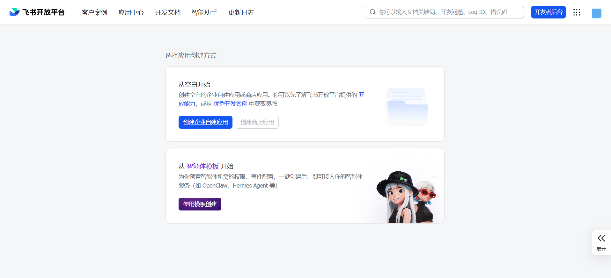

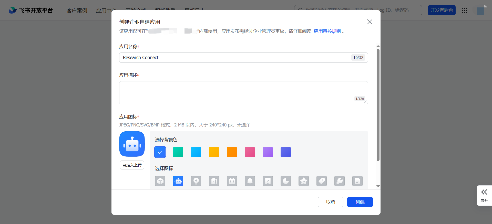

## 3. 添加机器人能力

1. 在应用详情页进入“添加应用能力”或“应用能力”。
2. 找到“机器人”。
3. 点击“添加”或“启用”。
4. 如页面允许设置机器人名称和说明，保持与应用名称一致即可。

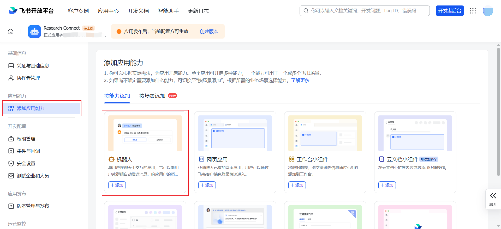

## 4. 开通最小权限

进入“权限管理”，搜索并开通以下三项权限。可以勾选后一次性批量开通。

| 权限 ID | 后台中的用途 | Research Connect 中的用途 |
|---|---|---|
| `im:message.p2p_msg:readonly` | 获取用户发给机器人的单聊消息 | 接收文字、命令和 PDF 消息事件 |
| `im:message:send_as_bot` | 以应用的身份发消息 | 回复对话、发送进度和结果 |
| `im:resource` | 获取与上传图片或文件资源 | 下载用户 PDF，上传日报文件和小红书图片 |

机器人菜单通过后面的事件订阅控制。本教程不申请群聊权限，也不申请通讯录、邮箱、云文档或日历权限。

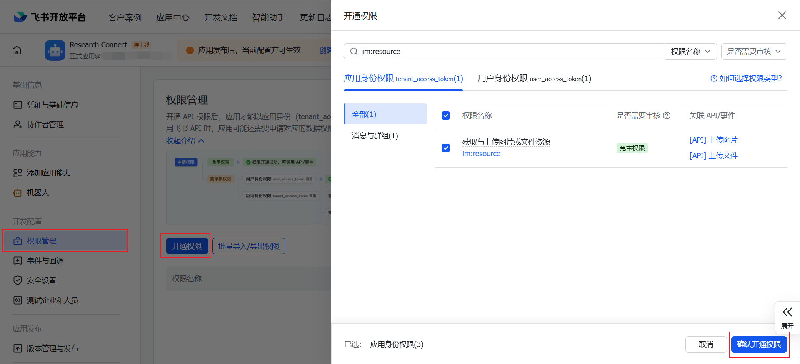

## 5. 获取 App ID 和 App Secret

1. 进入“凭证与基础信息”。
2. 复制 App ID，通常以 `cli_` 开头。
3. 查看并复制 App Secret。
4. 不要把 App Secret 发到群聊、截图、Git 提交或公开网页。

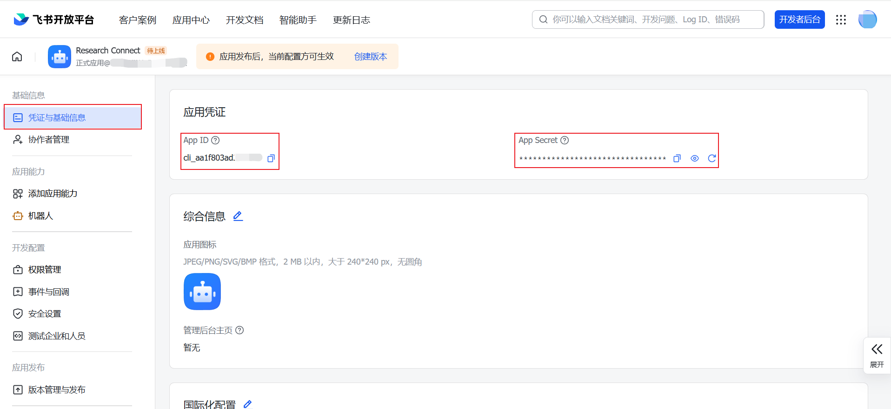

## 6. 在部署机器上填写凭据

以下命令在 Research Connect 仓库根目录执行。

先按照首页完成 Python 环境安装。需要 Docling 时使用：

```bash
./scripts/setup.sh --with-docling
```

Windows PowerShell：

```powershell
powershell -ExecutionPolicy Bypass -File .\scripts\setup.ps1 -WithDocling
```

安装脚本会在首次运行时创建 `apps/connect-hub/.env`，不会覆盖已有配置。

编辑 `apps/connect-hub/.env`，至少填写：

```dotenv
FEISHU_APP_ID=cli_xxx
FEISHU_APP_SECRET=请填写真实Secret
FEISHU_DOMAIN=feishu
FEISHU_REQUIRE_MENTION=true
FEISHU_ALLOWED_OPEN_IDS=
```

`FEISHU_ALLOWED_OPEN_IDS` 先保持空白，由飞书应用的可用范围负责限制访问。配置完成并取得自己的 open_id 后，可再设置二次白名单。

检查配置，命令不会打印 Secret。Linux：

```bash
./scripts/doctor.sh
```

Windows PowerShell：

```powershell
.\scripts\doctor.ps1
```

此时重点确认输出中的 `[OK] Feishu`。如果统一 LLM 还没有填写，命令会同时提示 LLM 缺失并返回非零状态；这不妨碍先建立飞书长连接。

## 7. 先启动飞书长连接

飞书开放平台只有检测到客户端在线，才能保存长连接订阅方式。保持下面的终端进程运行：

```bash
.venv/bin/connect-hub --env-file apps/connect-hub/.env feishu
```

Windows PowerShell：

```powershell
.venv\Scripts\connect-hub.exe --env-file apps\connect-hub\.env feishu
```

正常情况下，日志会显示正在连接飞书 WebSocket，随后出现连接成功信息。如果凭据错误，应先检查 App ID、App Secret 和 `FEISHU_DOMAIN=feishu`。

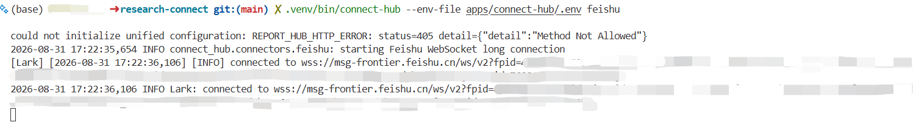

## 8. 配置事件订阅方式

保持第 7 步的进程运行，然后回到飞书开放平台：

1. 进入“事件与回调” → “事件配置”。
2. 编辑订阅方式。
3. 选择“使用长连接接收事件”。
4. 保存。

这里不要选择“将事件发送至开发者服务器”，也不需要填写请求地址。

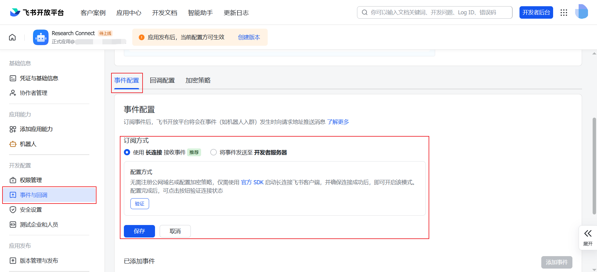

## 9. 添加两个必需事件

在事件配置页面添加：

1. `im.message.receive_v1`：接收消息；
2. `application.bot.menu_v6`：机器人自定义菜单事件。

如果后台显示事件版本，选择当前推荐的 2.0 版本。添加事件时如提示缺少权限，返回权限管理按提示补充，再继续。


## 10. 配置三个机器人菜单

进入“应用能力” → “机器人” → “机器人自定义菜单”。添加三个一级菜单，类型都选择“推送事件”。事件键必须完全一致，区分下划线但不区分展示文字。

| 菜单名称 | 类型 | 事件键 |
|---|---|---|
| 读论文 | 推送事件 | `connect_paper_reader` |
| 查引用 | 推送事件 | `connect_citationclaw` |
| 使用帮助 | 推送事件 | `connect_help` |

点击后，飞书将菜单事件发给本机 Connect Hub，再由机器人发送相应网页或帮助内容。

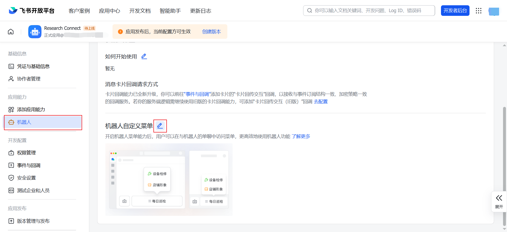

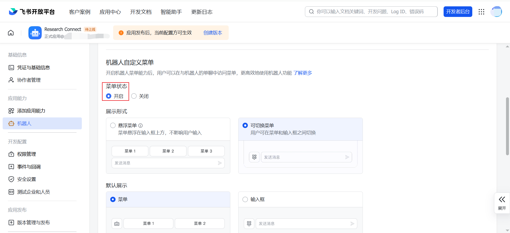

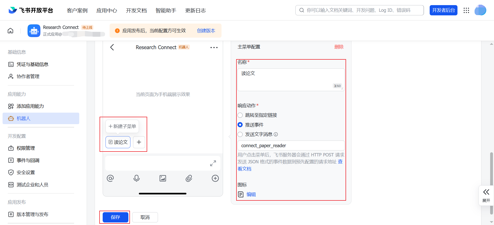

## 11. 创建版本并发布

权限、事件或菜单只有随应用版本发布后才会对最终用户生效。

1. 进入“版本管理与发布”。
2. 创建版本，例如 `0.1.0`。
3. 填写更新说明，例如“启用 Research Connect 单聊、PDF 与机器人菜单”。
4. 设置可用范围。个人 Demo 建议先只包含自己。
5. 提交发布。
6. 如果所在组织要求管理员审批，等待或联系管理员通过。

以后修改权限、事件或菜单，需要创建新版本并再次发布。

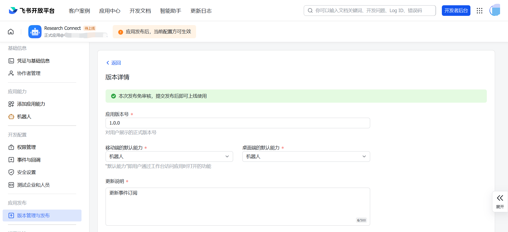

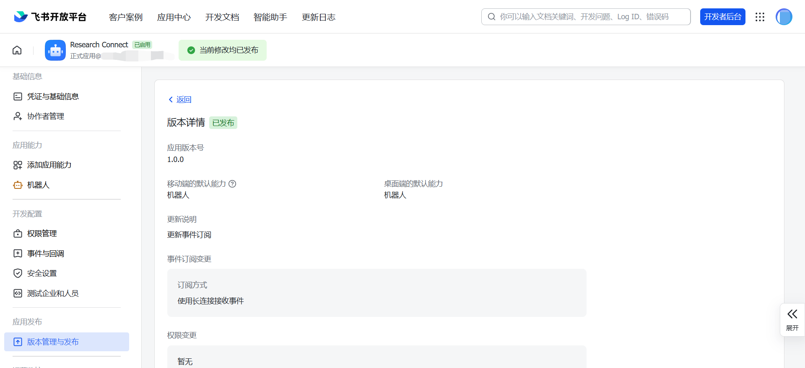

## 12. 在飞书中验收

1. 在飞书中搜索刚发布的机器人，进入单聊。
2. 发送 `/ping`。
3. 首次使用时，机器人应先发送统一配置中心链接，并回复 `pong`。
4. 检查聊天页底部是否显示三个菜单。
5. 依次点击并检查：
   - “读论文”：返回 Paper Reader 网页；
   - “查引用”：返回 CitationClaw 网页；
   - “使用帮助”：返回斜杠命令说明。
6. 发送 `/storage`，确认机器人能列出当前安装的公网网页和空间占用，并显示 `1/2/3/0` 管理选项。

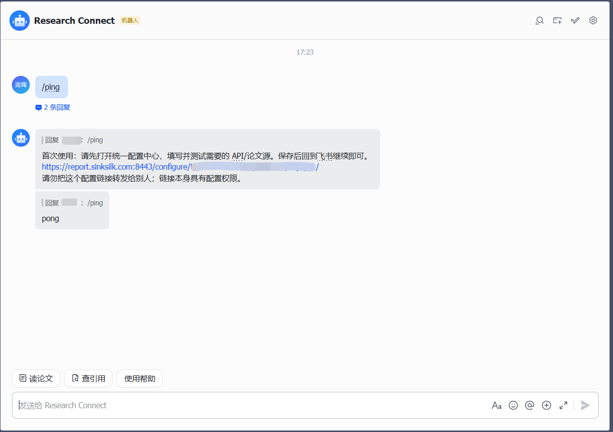

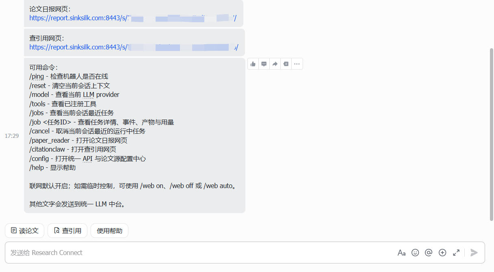

## 13. 切换到完整服务

飞书连接验收完成后，停止第 7 步的单独连接进程，再启动包含 Daily Paper、CitationClaw 和飞书连接的完整服务。Linux：

```bash
./scripts/start.sh
```

Windows PowerShell：

```powershell
.\scripts\start.ps1
```

同一个 App ID 不要同时运行多个 Connect Hub 实例。飞书长连接采用集群消费方式，多实例不会各自收到一份消息。

## 常见问题

### 保存长连接时提示没有客户端在线

确认第 7 步的进程仍在运行，并检查 App ID、App Secret、网络和中国版域名设置。

### 能收到消息但机器人不回复

检查 `im:message:send_as_bot` 是否已经随最新版本发布，以及账号是否在应用可用范围内。

### PDF 接收或结果附件发送失败

检查 `im:resource` 是否已经开通并发布；确认 PDF 不超过 30 MiB。

### 菜单没有显示

确认三个菜单已经保存，并在保存菜单后重新创建、发布了应用版本。退出机器人聊天再重新进入。

### 点击菜单没有反应

检查是否订阅并发布了 `application.bot.menu_v6`，事件键是否与本文完全一致，并确认 Connect Hub 长连接仍在线。

### 收到重复消息或消息被另一台电脑处理

不要让同一个 App ID 在多台电脑同时运行。停止旧实例，确认只保留一个 `connect-hub feishu` 或 `connect-hub serve` 进程。
