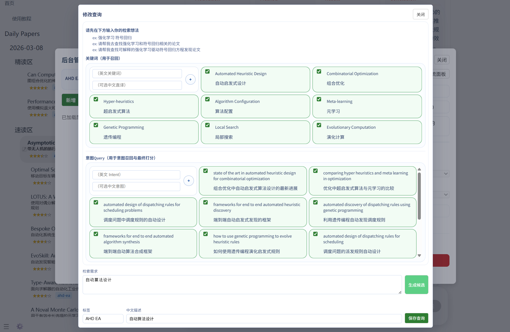
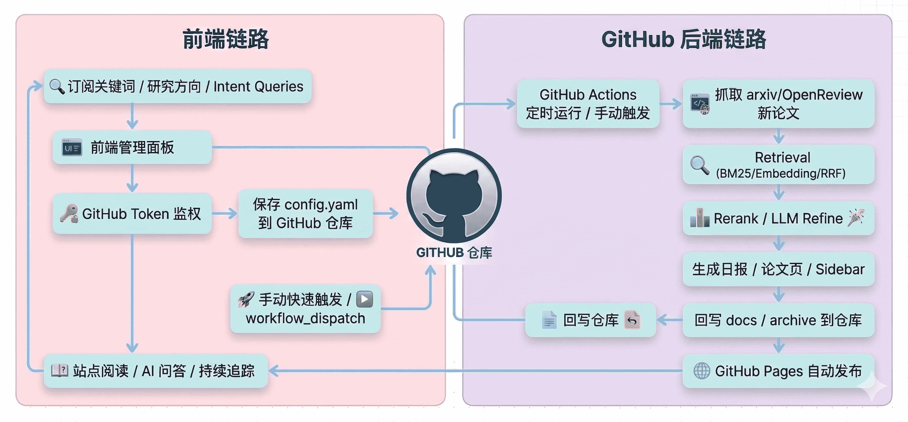

<p align="center">
  
</p>

<h2 align="center">Your Daily Companion for Discovering and Reading AI Papers</h2>

<p align="center">
  <a href="https://github.com/ziwenhahaha/daily-paper-reader/stargazers">
    
  </a>
  <a href="https://github.com/ziwenhahaha/daily-paper-reader/network/members">
    
  </a>
  <a href="https://github.com/ziwenhahaha/daily-paper-reader/blob/main/LICENSE">
    
  </a>
  <a href="https://ziwenhahaha.github.io/daily-paper-reader">
    
  </a>
  <a href="https://ziwenhahaha.github.io/daily-paper-reader/#/tutorial/README">
    
  </a>
</p>


## 🖼️ 界面预览
<p align="center">
  
</p>
<p align="center">
  
  
</p>

## 📰 News

- **2026-08-29** ⚡ 本地召回模式与依赖降险：新增「本地召回」开关——arXiv API 窗口增量抓取进本地 SQLite FTS5，embedding 语义精排（默认复用问答端点的 embeddings 模型，失败自动降级本地 bge-small），输出与云端链路同构，本地失败自动回退云端，共享数据库故障不再阻断日报；Reranker 四源可切（自建中转 / 公益端点 / SiliconFlow / 本地 GPU），默认远程化，并修复 new-api 中转 `qwen3-reranker` 渠道不兼容 `top_n` 参数导致的 500；设置面板新增模型列表拉取（`/v1/embeddings`、`/v1/models`）与连通性测试；上传 PDF / 网页总结自动识别论文标题、作者与真实来源（不再用文件名占位、不再硬编码 arxiv），venue 单独渲染。
- **2026-08-28** 🗄️🛡️ 综述召回与质量护栏：新增 Kaggle arXiv 全量快照粗筛路并设为默认（本地 314 万篇 FTS5 词法宽筛 + 语义漏斗，零网络零限流，A/B 实测宽筛 6-35 倍候选、相关度反升）；DeepXiv 转可选补充。同时上线防漂移三重护栏——中文主题自动转写英文检索查询、召回池与主题词面错位时直接终止（宁可不生成不可幻觉生成）、写作强制「论断须所引文献支撑」。首次使用需 `python scripts/build_kaggle_arxiv_index.py --download` 建库（约 15 分钟，建议每周刷新）。

- **2026-08-27** 📋 综述生成原生化：`#/survey` 页输入主题即可生成带引用编号的领域综述报告，本地后端新增 `/api/survey` 异步 Job（connect.job.v1 契约），九阶段流水线 `src/survey_pipeline.py` 复用日报基建（Supabase BM25+向量召回 / Reranker / DeepSeek 结构化抽取 / 聚类肘部法则选 k / 核心论文 PDF 深读 / 分节并行写作与审校），编排平移自原 paper_agent 多智能体设计并保留其并发闸门等实测经验；报告落盘 `docs/survey/` 并注册侧边栏「Survey Reports」分组；移除 `paper_agent/`、`integrations/` 外部子系统，修复 summarize/survey 页面冷加载挂载竞态。

- **2026-08-19** 📝 「论文总结」功能复用日报尾段完成闭环：贴 arXiv/网页链接或上传 PDF 后，总结结果会用与日报纸张页完全一致的数据结构落盘成 `docs/<日期>/<id>-<slug>.md`（速览五段 + 深度总结 + 图解读），并注册进侧边栏，可被未读等机制一并管理；同时修复外部来源（网页/PDF）在侧栏元数据里被误拼成 `arxiv.org/abs/<slug>` 的错误原文链接，改为显式传入真实原文 URL。

- **2026-08-18** 📰 首页新增「会议情报速览」：顶部原「公告与更新」面板改为展示最近会议节点（摘要投稿/全文投稿/录取通知/Camera Ready 等，含 CCF 等级徽标与剩余天数），点击可直达侧边栏完整会议日历；底部社区统计不受影响。
- **2026-08-18** 🗓️ 会议日程接入 CCFDDL 开源数据集：从 10 个硬编码会议扩展到 353 个 CCF 会议（A/B/C/N 全等级、10 大领域），截止日期自动换算 AoE/UTC/PT 时区为北京时间，倒计时精确到时分；新增按等级/领域筛选、会议搜索、本地收藏、ICS 日历导出与会议详情展开，每周自动同步官方最新数据。
- **2026-07-19** 🧾 统一首页公告与社区面板（`7457ab10`）：移除波浪、渐变和紫色宣传卡，改为一致的简洁信息面板，并完善桌面与移动端布局。
- **2026-07-07** 🎛️ 微调会议与侧边栏显示（`f202c703` / `a12d6d2b`）：ACL 2026 与 ICML 2026 年份按钮右上角增加星标提示，并将新版 sidebar 默认宽度从 373px 收窄到 298px，旧默认宽度会自动迁移到新宽度。
- **2026-07-07** 🏛️ 接入 ICML 2026 会议论文（`69a55296`）：从 OpenReview 同步 accepted 与公开 reject 共 6,555 篇论文，其中官方录取 6,341 篇，并补齐 PDF 链接、向量索引、统一会议检索与前端年份统计。
- **2026-07-07** 🏛️ 接入 ACL 2026 会议论文（`89351061`）：从 ACL Anthology 同步 Long / Short / Findings 共 4,459 篇公开论文，补齐 PDF 直链、向量索引与会议年份统计，并开放前端 ACL 2026 年份按钮。
- **2026-07-01** 🧭 修复侧边栏 v2 收起与冻结层细节（`adaa0dab` / `9384abb4` / `5b9c807a`）：大屏收起后侧边栏真正归零，正文重新居中；论文页 AI 输入框、模型选择、底部工具区与问题面板随正文一起居中，并修复冻结标题遮罩压住首篇论文的问题。
- **2026-07-01** 🔄 支持 Sync Fork 后再更新自有静态资源（`19ceb63a`）：项目自有 `app/*.js` / `app/*.css` 默认从当前站点本地加载，只有显式配置版本时才走不可变 CDN 路径，避免 CDN 自动部署后用户立即拿到未同步资源。
- **2026-07-01** 🏛️ 打通统一会议年份检索（`801c1c1b` / `4de71724` / `13154da5`）：新增统一会议论文入口与 RPC 过滤能力，前端可把多个会议年份组合成一次检索，并按所选论文总数限制在 3 万篇以内，同时按论文数量线性估算费用与耗时。
- **2026-07-01** 🎛️ 微调会议年份按钮展示（`8dcc05c0` / `91e02269`）：设置页会议面板改为双列滚动布局，并统一年份统计数字颜色。
- **2026-06-30** 📊 展示会议年份统计（`7ea7204b`）：会议年份按钮直接展示库内数量 / 官方录取数量，并将统计快照写入前端静态数据。
- **2026-06-29** 🏛️ 接入系统与安全会议数据源（`e00d82aa` / `9412598a` / `92c9705f`）：新增 OSDI / SOSP / IEEE S&P / NDSS 的本地 SQL、抓取维护入口、Supabase 同步与公开 PDF 回退抓取。
- **2026-06-24** 🛡️ 修复侧边栏跨运行覆盖问题：日报 Step 6 的 `update_sidebar` 改为在同一日期 marker 下按 `paper_id` 去重合并而非整块替换；会议侧边栏写入加文件锁、`conference-paper-retrieval` workflow 改为按"会议+年份"独立 concurrency group 并用重试式 push（rebase 冲突时重跑 `conference_sidebar.py` 合并），避免多次时间窗 / 多会议并行触发互相覆盖。
- **2026-06-23** 🔑 支持自定义域名部署：CI 自动写入 `.repo-owner.json`，前端优先读取该文件检测仓库归属，Token 验证阶段即校验用户与站点所有者是否一致；未同步此改动的用户（非自定义域名）仍走原有检测逻辑，完全灰度兼容。
- **2026-06-23** 🎛️ 会议检索面板改为双列布局，减少纵向滚动。
- **2026-06-22** 🏷️ 新增侧边栏未读 badge 与拖拽消除：论文分组显示未读计数红点，拖拽红点即可批量标记已读；阅读状态支持跨设备同步到 Supabase。
- **2026-06-21** 🏛️ 前端接入 9 大会议检索：支持 NeurIPS / ICLR / ICML / AAAI / CVPR / ECCV / IJCAI / ACL / EMNLP，按年份筛选并提供费用与时间预估。
- **2026-06-20** 📎 所有 SQL RPC 新增 `pdf_url` 字段返回，会议论文支持 CVF / ECVA / ACL Anthology 等多来源 PDF 直链跳转。
- **2026-06-19** 🧮 修复论文页 LaTeX 公式渲染：保护 `\\[...\\]` 和 `\\(...\\)` 块不被 Markdown 解析器破坏。
- **2026-05-31** 💬 优化论文页 AI 对话输入体验：输入框支持随内容自动增高，超过上限后在输入区内部滚动；同时调整按钮布局与点击层级，避免底部工具条遮挡发送和最近提问按钮。
- **2026-05-30** ⚙️ 提升 Step 6 文档生成稳定性：结构化输出 `max_tokens` 提升到 16k，并让每个并发论文处理线程使用独立 LLM Client，避免共享客户端参数互相覆盖。
- **2026-05-30** 🧹 精简图表提取依赖链路：移除 Java / `pdffigures2` 依赖，修复 GitHub Actions 中 `setup-java` 相关失败，并统一 PaperCropper 图表提取降级日志。
- **2026-05-25** 🎛️ 重构后台管理体验：日常与会议面板统一词条卡片、批量选择、底部操作区与危险操作分区；新增仅会议临时词条，优化候选生成、关键词编辑、最近提问与模型选择弹窗样式。
- **2026-05-25** 🖼️ 优化论文阅读页媒体展示：为 Attention 示例补充图片轮播，并固定轮播展示高度，避免切图时按钮位置跳动。
- **2026-05-24** ⚡ 优化 GitHub Pages 首屏加载：本地化/延迟加载非首屏脚本，移除 Google Fonts 阻塞，并支持 CDN 静态资源加速与失败回退。
- **2026-05-24** 🔐 修复静态密钥解锁链路：Pages 环境优先读取项目根目录 `secret.private`，避免已有密钥时误进入初始化向导。
- **2026-05-24** 🧾 收紧会议论文展示规则：会议检索结果只保留并展示 4 分及以上论文，统一进入精读页生成与图片提取流程。
- **2026-05-23** 🏛️ 打通会议论文阅读闭环：会议检索结果写入侧边栏，点击后进入本地介绍页；会议正文页对齐日常论文页的标题、元数据、标签、摘要与排版。
- **2026-05-23** 🧠 强化远端模型链路：默认使用 `zwwen` 远端 embedding 与 rerank，补齐 DeepSeek V4 长输出、JSON 截断恢复和前端探活兼容处理。
- **2026-05-23** 🔧 完善本地调试与密钥保存：本地后端支持触发 GitHub Actions 对应工作流，配置保存会同步写入本地 dotenv / `secret.private`，并修复密钥入口、弹窗与日志刷新问题。
- **2026-05-22** 🚀 新增本地一键部署与调试入口：支持局域网本地页面触发后端任务，默认 CPU 依赖与远端 embedding，降低本机运行门槛。
- **2026-05-22** 🌐 接入公益向量与重排服务：新增 `zwwen.online` embedding / rerank 链路，并让前端 reranker 测试在公益模式下免 API Key。
- **2026-05-21** 🧩 重整本地初始化与模型配置：支持本地 dotenv 调试配置，更新 DeepSeek 默认模型到 V4，并移除旧的柏拉图 / BLT 配置链路。

<details>
<summary>Earlier 2026 updates</summary>

- **2026-05-19** 🧪 补充 rerank 预算实验工具，便于对不同模型、候选池规模与调用预算做离线评估。
- **2026-05-03** 🎚️ 支持前端选择 reranker，并补充硅基流动 rerank 的限速重试与实验随机种子固定。
- **2026-05-02** 🧩 收敛模型配置入口：工作流只保留 DeepSeek API，重排改为本地 `Qwen/Qwen3-Reranker-0.6B`。
- **2026-04-08** 🏷️ 推荐状态改为按 tag 独立维护：`carryover` 时间与历史 `seen_ids` 不再跨词条互相污染，单词条 `10 天` / `30 天` 抓取、回补与复跑更稳定。
- **2026-03-28** 🧬 补齐多源论文维护链路：新增并打通 `bioRxiv`、`medRxiv`、`ChemRxiv` 以及多类会议论文的抓取、向量编码、Supabase 同步与检索 SQL，支持将多源论文纳入统一推荐与阅读流。
- **2026-03-28** 🎯 后台管理支持按词条单独触发抓取：可对指定 tag 直接运行 `10 天`、`30 天速览`、`30 天标准` 等任务，便于灰度验证、单主题回补与问题排查。
- **2026-03-28** 🛡️ 提升 embedding 与多源检索稳定性：修复多源 embedding 查询分组时机问题，并在远程 embedding 首次失败后对整轮任务熔断回退到本地模型，避免分片阶段反复超时。
- **2026-03-28** 🖼️ 优化论文详情页阅读体验：支持 `bioRxiv` 论文插图提取与展示，并改进元信息区域中长 PDF 链接的换行与布局表现。
- **2026-03-17** ⚙️ 修复 GitHub Actions 对 Python patch 版本路径的硬编码依赖，并将 `actions/checkout`、`actions/setup-python`、`actions/cache` 升级到 Node 24 对应版本，消除 runner 升级与 Node 20 弃用带来的工作流告警。
- **2026-03-13** 🔌 接入固定远程 embedding 服务入口：query embedding 缓存下沉到每条 `keyword` / `intent_query` 并按 hash 复用；同时收紧 Upstream Sync 工作流与触发面板的非 Fork 场景提示，对齐相关测试断言并恢复全量 `pytest` 通过。
- **2026-03-12** 🧠 调整统一候选池进入重排的策略：支持各 lane 保底候选进入统一池，并将统一池预算改为按论文规模与 `intent_query` 数量动态计算。
- **2026-03-11** 🛡️ 完善 Supabase 召回与推荐链路：BM25 / exact 增加时间分片与递归细分兜底，Supabase-only 召回改为动态 Top K；前端收紧关键词与意图 Query 选择数量并补充已选数量展示。
- **2026-03-10** 📝 更新 README 快速启动指引与 Fork 按钮样式，优化新手进入项目时的操作路径与展示细节。
- **2026-03-09** 📚 对齐 Zotero 一键保存链路到当前摘要结构，补齐聊天区写入，并清理 Attention 样本里的旧版摘要结构。
- **2026-03-09** 🖼️ 更新 README 多图界面预览与新手引导文案，并修复 gist 分享时摘要前的格式异常。
- **2026-03-08** 🛡️ 优化 `daily pipeline` 提交与推送逻辑，提交后先同步远端再 push，降低用户更新配置时的冲突概率。
- **2026-03-07** 🎨 更新首页与 README 展示文案，补充界面预览图，完善项目对外说明。
- **2026-03-06** 🛠️ 修复 LLM refine 补分与组合 query 打分逻辑，并补上回归测试；新增首页使用教程入口并修复移动端导航与教程路由。
- **2026-03-05** 🚀 后台面板新增 30 天标准快速抓取入口，加入指定 arXiv 论文逐阶段命中追踪；向量召回改为 exact 优先并增加 ANN 低密度回退。
- **2026-03-04** 🧹 新增内容重置工作流入口，后台支持更安全地重建初始内容与站点数据。
- **2026-02-20** ✨ 日报输出新增 AI 简报与评分展示；Zotero Action 改进为支持批量处理与 Better Notes 公式来源。
- **2026-02-08** 🔗 支持 Supabase 向量同步，并优先复用用户侧预置 embedding，补齐公开数据同步链路。
- **2026-02-07** 🎛️ 优化后台管理面板交互与布局，订阅面板向单路多关键词召回演进。
- **2026-02-06** 🧠 重构推荐链路，引入 smart query、布尔检索与订阅规划模块，并补上对应测试。
- **2026-01-24** 👀 新增 workflow 监视面板，便于直接查看后台任务运行状态。
- **2026-01-11** 📝 补齐第 6 步论文总结模块，打通每日推荐结果到文档生成的闭环。
- **2026-01-10** 🧱 推荐系统大改版，alias 统一为 tag，召回、排序与 LLM refine 链路拆分成独立步骤。

</details>

<details>
<summary>Earlier project milestones</summary>

- **2025-12-31** 🧭 新增统一引导面板，把主要设置集中到同一个入口。
- **2025-12-29** 🌐 项目切换到纯前端架构，订阅、配置与 GitHub Token 管理前置到浏览器端。
- **2025-12-23** 🧩 首页与侧边栏完成模块化拆分，同时将大模型接口迁到前端，界面交互开始成型。
- **2025-12-22** 🍴 调整为 Fork 即用版本，进一步降低自部署门槛。
- **2025-12-17** 🌱 最小可运行版本落地，并完成早期 Zotero Connector 集成。

</details>

## ✨ Why Daily Paper Reader?

- **🔎 Daily Paper Radar**：每日自动抓取 arXiv / OpenReview 新论文，持续追踪研究前沿。
- **🎯 Personalized Feed**：基于关键词、研究方向与兴趣生成个性化推荐流。
- **📖 Read in Context**：支持摘要、原文、速览、长总结在同一页面串联阅读。
- **💬 Ask While Reading**：支持 AI 论文问答，边读边问，沉淀私人讨论记录。
- **🚀 Zero-Server Deployment**：依托 GitHub Actions 自动更新、GitHub Pages 部署，无需额外服务器。
- **🛠️ Fork-and-Run**：Fork 后完成少量配置，即可上线自己的论文主页。

## 🧭 适用场景

- **🎓 个人论文雷达**：持续追踪自己研究方向的新论文。
- **🧪 实验室论文主页**：沉淀团队关注的论文脉络与阅读结果。
- **📚 日常阅读工作台**：把发现、阅读、问答、总结集中到一个入口。


## ⚙️ Workflow Architecture



## 🚀 纯本地快速启动（Gitee / 不用 GitHub 的用户看这里）

> [!TIP]
> 不需要 Fork、不需要 GitHub Actions、不需要自建数据库。仓库内置的共享 Supabase 通过只读 API 提供召回数据（新论文由上游定时入库，用户零维护），克隆下来配一个 API Key 就能跑通全部功能。

```bash
git clone https://gitee.com/lp18026522720/daily-paper-reader.git
cd daily-paper-reader
pip install -r requirements.txt
python src/local_server.py --serve
```

浏览器打开 `http://127.0.0.1:8567` 即可使用。仅剩一件事——**配置一个 OpenAI 兼容的大模型 API**（AI 问答、LLM 精炼打分、综述生成都用它；DeepSeek、通义、Kimi、Gemini 兼容端点等均可）：

- 🌐 准备任意 OpenAI 兼容 API 的 **Base URL + API Key + 模型名**（以 DeepSeek 为例：[platform.deepseek.com](https://platform.deepseek.com/) 注册后在 API Keys 页创建）
- 🔐 左下角「设置」齿轮填入并保存（写回本机 `config.yaml` 的 `local.chat` 段），或写入 `.env`（`LLM_API_KEY` / `DEEPSEEK_API_KEY`，自定义端点加 `LLM_BASE_URL`、`LLM_MODEL`）

各功能说明：

- **论文站点 + AI 问答**：开箱即用，端口仅监听 127.0.0.1
- **每日日报**：召回走内置共享 Supabase；本地定时由 `config.yaml` 的 `local.schedule` 控制（默认开启）
- **论文综述**：`#/survey` 页直接可用；想启用全量 Kaggle 快照粗筛主路，按 [Kaggle 索引安装说明](#-论文综述内置功能) 建库（可选，不装会自动降级）
- **订阅方向修改**：网页端订阅管理走 GitHub API 写回 `config.yaml`，纯本地模式不可用——直接编辑本机 `config.yaml` 的 `subscriptions.intent_profiles`，或用设置面板保存

Windows 无 bash 环境可用 `scripts\run_local.bat` 启动；机器配置自查见 [SYSTEM_REQUIREMENTS.md](SYSTEM_REQUIREMENTS.md)。

## 🖥️ 本地化部署

> 📊 **部署前先看 [SYSTEM_REQUIREMENTS.md](SYSTEM_REQUIREMENTS.md)**：三种用法对机器的要求完全不同——纯云端模式无本机要求；本地轻量后端 4GB 内存即可；本地 GPU 精排需 4GB 显存。文档含各组件内存/显存/磁盘的实测画像与自查方法。

如果你只需要在本地启动论文站点和 AI 问答，不需要运行完整的论文推荐流水线，可以直接启动本地服务：

```bash
python src/local_server.py --serve
```

若在 Windows 且命令行不便，也可双击 `scripts\run_local.bat`（无需 WSL/bash）；Unix/Linux 下可用 `bash scripts/run_local.sh`。

然后浏览器打开：

```text
http://127.0.0.1:8567
```

- **LLM + 论文抓取才需要网络**：AI 问答通过 `/api/chat` 本地代理转发到 DeepSeek（或其他 OpenAI 兼容 API），除此之外所有静态资源、前端逻辑、阅读状态均在本地完成。
- **密钥与配置放在本机**：模型 Key 写在 `config.yaml` 的 `local.chat` 段或 `.env` 的 `DEEPSEEK_API_KEY`，不再存储在浏览器 `secret.private` 中。
- **AI 问答走本地代理**：前端将聊天请求发给本地 `/api/chat`，后端读取本机密钥后转发给大模型，前端不直接持有 API Key。
- **日报定时由本地调度**：`config.yaml` 的 `local.schedule` 控制是否每天自动跑一次流水线（默认 `enabled: true`，时间 `18:30` UTC）。
- **端口仅绑定 127.0.0.1**：本地服务默认只监听 localhost，不会暴露到局域网或公网。

**网页端设置面板**：左下角「设置」齿轮（或论文页问答区的设置按钮）可交互修改本地服务配置——AI 问答的模型、API 端点、API Key，每天定时跑流水线的开关与时间，以及 Reranker 精选后端。点击「保存」即写回本机 `config.yaml`（只更新本地服务相关字段，不影响其它配置段）。API Key 输入框留空表示沿用 `.env` 里的 `DEEPSEEK_API_KEY`。面板还支持「获取模型列表」（填好端点与密钥后从 `/v1/models` 拉取，下拉直接选择）与「测试连通性」（发一次最小对话请求并显示真实耗时）。

### 🎛️ Reranker 精选后端（默认远程）

Reranker 重排默认走**远程 API**（zwwen 公益端点），不用本机 GPU、无需下载 Torch 模型；实测速度与本地 GPU 打平。切换方式（优先级从高到低）：

1. **设置面板**：「Reranker 精选后端」下拉选择，保存即生效（下一次流水线/综述生效，无需重启本地服务）；
2. **`.env`**：`RERANK_PROFILE=public-zwwen-rerank`（默认）/ `public-sinksilk-rerank` / `siliconflow-qwen3-0.6b` / `local-qwen3-0.6b`。

四档含义：

| 预设 | 后端 | 说明 |
|------|------|------|
| `public-zwwen-rerank` | zwwen.online 公益端点 | 默认。免 API Key 配置，内置公共密钥兜底 |
| `public-sinksilk-rerank` | sinksilk 中转站 | 自建 new-api 中转的用户适用，模型名 `qwen3-reranker` |
| `siliconflow-qwen3-0.6b` | SiliconFlow | 需 `SILICONFLOW_API_KEY`，有免费额度与限速 |
| `local-qwen3-0.6b` | 本地 GPU/CPU | 需 `pip install -r requirements-local-models.txt`，首次运行下载模型；`LOCAL_RERANK_DEVICE` 控制设备 |

用 GitHub Actions 跑流水线的用户同样默认远程：`RERANK_PROFILE` Secret 未设置时自动使用 `public-sinksilk-rerank`。

### 🔍 召回模式（云端 / 本地）

日报召回默认走云端 Supabase RPC（BM25 + 向量）。共享数据库偶发时段性超时时，可切换**本地召回模式**：每次运行先从 arXiv API 增量抓取窗口论文进本地 SQLite（约 3-5 分钟），再用本地 FTS5 词法召回 + embedding 语义精排（默认复用问答端点的 embedding 模型，失败自动降级本地 bge-small），lane 输出与云端链路同构，后续 RRF / rerank / LLM 步骤完全一致——整条召回不依赖 Supabase。

- **切换**：设置面板「召回模式」（保存后下一次流水线生效），或 `config.yaml` 的 `local.recall.mode: local`，或 `.env` 的 `DPR_RECALL_MODE=local`
- **embedding 源**：默认 `openai` = 复用问答端点的 `/v1/embeddings`（如中转站的 qwen3-embedding），**无需安装任何本地模型**；查询与候选合并一次编码，保证同一向量空间。变量：`DPR_LOCAL_EMBED_PROVIDER`（openai/local）、`DPR_LOCAL_EMBED_MODEL`、`DPR_LOCAL_EMBED_BASE_URL`
- **初始配置零重依赖**：默认组合（云端召回 + 远程 rerank + 端点 embedding）不需要 torch/GPU；本地 bge 兜底属于可选项，仅在端点无 embeddings 且想完全离线时才需要 `pip install -r requirements-local-models.txt`
- **网络韧性**：arXiv API 直连不稳时自动尝试系统代理；全部路线失败但本地库已有窗口数据时降级继续（本地库为空才中断）
- **同日免重抓**：arXiv 每天一批公布，同一 UTC 日内重复运行自动跳过重复抓取（`--force` 或 `DPR_LOCAL_FETCH_FORCE=1` 强制）
- Kaggle arXiv 大索引（`scripts/build_kaggle_arxiv_index.py`）只服务综述与长窗口，日报本地召回不需要它

## 🧪 本地调试模式

如果你在本机开发，不想点击按钮后触发 GitHub Actions，可以启动本地调试后端：

```bash
scripts/bootstrap_local.sh
```

这个脚本会自动创建 `.venv`、安装远程服务模式依赖、按需从 `.env.example` 生成 `.env`，然后启动本地后端。默认不会下载 `torch` 等重依赖。启动完成后访问：

```text
http://127.0.0.1:8567
```

如果你已经准备好了 Python 环境，也可以只启动后端：

```bash
scripts/local_debug.sh
```

也可以手动指定监听地址和端口：

```bash
python src/local_debug_server.py --host 127.0.0.1 --port 8567
```

如果需要跳过依赖安装，可以使用：

```bash
DPR_SKIP_INSTALL=1 scripts/bootstrap_local.sh
```

如果只想启动并明确跳过依赖安装，也可以使用旧的快速部署模式：

```bash
DPR_INSTALL_MODE=minimal scripts/bootstrap_local.sh
```

如果要一次性安装完整运行依赖，可以使用：

```bash
DPR_INSTALL_MODE=full scripts/bootstrap_local.sh
```

完整依赖模式默认先安装 **CPU 版 PyTorch**，避免普通本机部署时误下载 CUDA 大包。如果你确实需要自定义 PyTorch 源，可以设置：

```bash
DPR_INSTALL_MODE=full DPR_TORCH_INDEX_URL=https://download.pytorch.org/whl/cpu scripts/bootstrap_local.sh
```

在 `localhost / 127.0.0.1` 页面里点击“触发工作流”时，前端会自动调用本地后端 `/api/local/workflows/dispatch`，把 `daily-paper-reader.yml`、`conference-paper-retrieval.yml` 等映射为本地 Python 子进程执行，不会上 GitHub，也不会要求启用 Actions。运行日志会显示在工作流面板里，并保存在 `.local-runs/`。

如果前端和本地后端不是同一个地址，可以在页面加载前设置：

```html
<script>
  window.DPR_LOCAL_API_BASE = 'http://127.0.0.1:8567';
</script>
```

如果要部署到自己的服务器上调试，请同时启动这个后端，并对内网或受信任网络开放端口：

```bash
DPR_LOCAL_HOST=0.0.0.0 DPR_LOCAL_PORT=8567 scripts/local_debug.sh
```

然后访问 `http://<服务器地址>:8567`。这样页面和后端同源，点击触发按钮会在服务器本机执行工作流命令，而不是调用 GitHub Actions。

## 📋 论文综述（内置功能）

综述生成是本地后端的内置功能，不再依赖任何外部子系统：在站点 `#/survey` 页输入研究主题，本地后端（`python src/local_server.py`，默认 8567）会以异步 Job（connect.job.v1 契约）跑完「召回 → Reranker 精选 → 逐篇结构化抽取 → 向量聚类（肘部法则选 k）→ 核心论文 PDF 深读 → 簇深析 + 全局分析 → 导演大纲 → 限流并行写作 → 审校」九个阶段，报告落盘为 `docs/survey/<slug>-<hash>.md` 正式页面并注册进侧边栏「Survey Reports」分组。

- 实现位于 `src/survey_pipeline.py`（编排）与 `src/survey_docs.py`（落盘 + 侧栏注册），全部复用日报基建（Supabase 召回、Reranker、DeepSeek 客户端、PDF 抽文）；API 为 `POST /api/survey` 系列（见 `src/local_server.py`）。
- 也可 CLI 调试：`python src/survey_pipeline.py --query "多模态大模型的安全与对齐" --max-papers 30 --fetch-days 9`。
- 开启核心论文 PDF 深读时整份报告通常需要几分钟到十几分钟，前端有分阶段进度与取消按钮。

### 📦 Kaggle arXiv 快照索引安装（综述默认召回路）

综述默认召回主路基于 Kaggle 官方 [Cornell-University/arxiv](https://www.kaggle.com/datasets/Cornell-University/arxiv) 全量快照（约 314 万篇元数据），在本地建 SQLite FTS5 索引后毫秒级词法粗筛，零网络、无限流、支持全历史回溯。**不装也能跑综述**（自动回退本地库 + 种子引文路，覆盖窄很多），装好后效果完整。

**1) 准备 Kaggle 凭据（免费账号即可）**

登录 [Kaggle](https://www.kaggle.com) → 头像 → **Settings → API**，二选一：

- **新式单 token**（推荐）：点击 *Create New Token*，得到 `KGAT_` 开头的 token，写入 `.env`：
  ```bash
  KAGGLE_API_TOKEN=KGAT_xxxxxxxxxxxxxxxx
  ```
- **传统 kaggle.json**：同页下载 `kaggle.json`，把其中两个字段写入 `.env`：
  ```bash
  KAGGLE_USERNAME=你的Kaggle用户名
  KAGGLE_KEY=kaggle.json里的key
  ```

走系统代理下载时还需在 `.env` 加一行（默认不走代理，与 DeepXiv 同一套路数）：

```bash
KAGGLE_TRUST_ENV=1
```

**2) 下载快照并建索引**

```bash
python scripts/build_kaggle_arxiv_index.py --download
```

- 一次性下载 ~4GB 快照（视带宽 10-30 分钟）并建 FTS 索引，全程约 15-40 分钟
- 产物在 `archive/kaggle_arxiv/`（已 gitignore）：`index.sqlite3` 索引库 + 下载的 JSON
- 想把索引放到其它盘：`DPR_SURVEY_KAGGLE_INDEX=/d/kaggle_index/index.sqlite3`（或 `--db-path` 参数）
- 下载的 zip 默认建完即清理；想保留原始 JSON 加 `--keep-json`

**3) 刷新与验证**

- 快照由 Cornell 官方周级同步，**建议每周重跑一次**上面的命令刷新（重复执行会重建索引，无增量开销问题）
- 建好后无需任何服务重启，综述页勾选「Kaggle 快照粗筛」（默认开）即可使用
- 未建索引 / 凭据缺失时 Kaggle 路自动跳过并在进度里提示，不影响其它召回路

详细链路说明见 [docs_init/tutorial/survey.md](docs_init/tutorial/survey.md)。

## 🗓️ 会议日程数据源（CCFDDL）

侧边栏「🗓 会议日程」面板的会议截止日期来自 **[CCFDDL](https://github.com/ccfddl/ccf-deadlines)（MIT 协议）开源会议数据集**，覆盖 300+ CCF 会议、A/B/C/N 全等级、10 大研究领域，截止时间自动换算为北京时间。

- **自动同步（默认）**：`.github/workflows` 里的 `refresh-conference-schedule.yml` 每周定时运行 `scripts/sync_ccfddl_deadlines.py`，拉取最新数据、重新生成 `app/conference-schedule.json` 并自动提交。普通用户无需任何手动操作。
- **本地手动更新**：需要联网拉取数据集并重新生成 JSON：

  ```bash
  pip install -r requirements.txt   # 已含 requests / pyyaml
  python scripts/sync_ccfddl_deadlines.py
  ```

  可选 `GITHUB_TOKEN` 环境变量可提高 GitHub API 拉取配额的速率上限（未设置也能拉取）。

- **离线 / 测试**：若已 `git clone` 了 CCFDDL 仓库，可不联网直接解析本地目录：

  ```bash
  python scripts/sync_ccfddl_deadlines.py --local-dir <CCFDDL克隆目录>
  ```

- **手工补充节点**：CCFDDL 只有投稿截止日期，review / 录取通知 / Camera Ready 等中间里程碑需要通过 `scripts/ccfddl_overrides.json` 手工维护，运行时会合并进输出。

## 🙏 致谢

Daily Paper Reader 的论文发现、重排与阅读增强链路受益于以下开源项目、模型与服务：

- **[PaperCropper](https://github.com/fake-learn/PaperCropper)**：为论文 PDF 中的图表检测与裁剪提供了重要参考和能力基础，让论文详情页可以更自然地展示图表内容。
- **[BAAI/bge-small-en-v1.5](https://huggingface.co/BAAI/bge-small-en-v1.5)**：作为默认 embedding 模型之一，支撑语义召回、会议论文检索与查询向量复用。
- **[Qwen/Qwen3-Reranker](https://huggingface.co/Qwen)**：作为重排链路的重要开源模型基础，用于提升候选论文排序质量。
- **zwwen.online 公益服务**：提供默认远端 embedding / rerank 接入，降低普通用户本地部署时的模型下载、显存和算力门槛。
- **硅基流动（SiliconFlow）**：提供可选的 rerank API 接入方式，便于在不同模型尺寸和调用预算之间做实验与切换。
- **DeepSeek**：为候选过滤、论文精读摘要与问答等 LLM 环节提供模型能力支持。

## ❓ FAQ

### 💻 需要服务器吗？

不需要。项目基于 **GitHub Actions + GitHub Pages** 运行和部署。

### 🎛️ 可以做哪些个性化配置？

你可以调整订阅关键词、研究方向、查询意图与日常阅读偏好，构建自己的论文推荐流。

### 👨‍🔬 适合实验室或团队一起用吗？

可以。它很适合做实验室公共论文面板，或者作为团队内部的论文发现与阅读入口。

## 💬 欢迎交流

QQ 群：583867967（欢迎交流，已有：1151 人）


## ⭐ Star History

<a href="https://www.star-history.com/?type=date&repos=ziwenhahaha%2Fdaily-paper-reader">
 <picture>
   <source media="(prefers-color-scheme: dark)" srcset="https://api.star-history.com/chart?repos=ziwenhahaha/daily-paper-reader&type=date&theme=dark&legend=top-left&sealed_token=HZNlFXt8xbwRv5OoiqbjkjDPJoOuXlfSMxuVmHWAdDqfd9IVMab3xcK4VxF3DlJAvaO71PL3smUpfEw-NjNT83w8NqNJ0UPIhoNcxbiPhTMQkoMhkawF1w" />
   <source media="(prefers-color-scheme: light)" srcset="https://api.star-history.com/chart?repos=ziwenhahaha/daily-paper-reader&type=date&legend=top-left&sealed_token=HZNlFXt8xbwRv5OoiqbjkjDPJoOuXlfSMxuVmHWAdDqfd9IVMab3xcK4VxF3DlJAvaO71PL3smUpfEw-NjNT83w8NqNJ0UPIhoNcxbiPhTMQkoMhkawF1w" />
   
 </picture>
</a>
